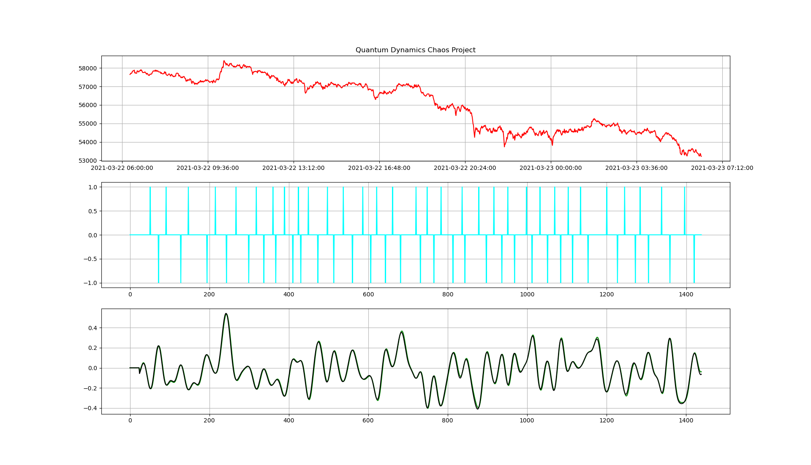
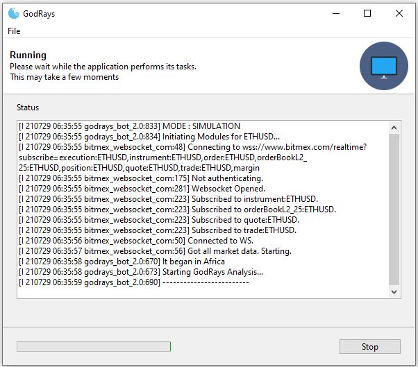

# Genesis
Sophisticated Scalper Bot for BitMEX using cyclical analysis

------------------------------------

  

Here's a proof-of-concept that illustrates the use of Fast Fourrier Transform to analyse cyclical events. We have dedicated a lot of time to ensure stability and robustness to this algorithm. It starts by caching historical data (in order to speed up its treatment) for several minutes and then comes the analysis and after that, the decision process kicks in.

  

------------------------------------

# Installation / Execution

Just download the latest release, install it and launch the exe to see the simulation mode in action with real-time data coming from BitMEX. No API keys needed. If you want to reset the test, just delete 'order.csv' (if present), 'position.csv' and 'pnl.csv'...

------------------------------------

## Disclaimer
The article and the relevant codes and content are purely informative and none of the information provided constitutes any recommendation regarding any security, transaction or investment strategy for any specific person. The implementation described in the article could be risky and the market condition could be volatile and differ from the period covered above. All trading strategies and tools are implemented at the users’ own risk.
