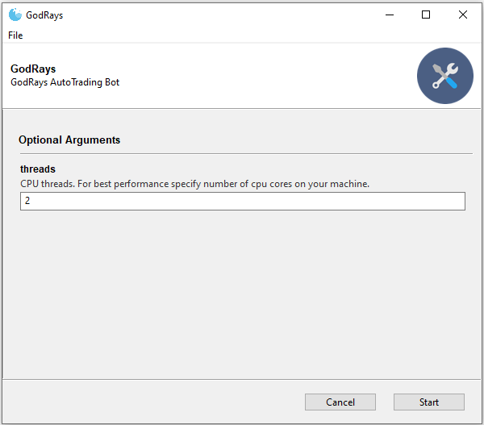

# Trinity
Sophisticated Scalper Bot for BitMEX using GodRays methodology, Fast Fourrier Transforms and Brownian Motions

------------------------------------

  
  
  

Here's a proof-of-concept that illustrates the use of GodRays analysis, Fast Fourrier Transforms and Geometric Brownian Motions to gain an edge over the markets. We have dedicated a lot of time to ensure stability and robustness to this algorithm. It starts by caching historical data (in order to speed up its treatment) then it analyzes the latest data and after that, the decision process kicks in.

  
  

------------------------------------

## Installation / Execution

Just download the latest release and launch the exe (as admin) to see the simulation mode in action with real-time data coming from BitMEX. NO API KEYS NEEDED.

------------------------------------

## Disclaimer
The article and the relevant codes and content are purely informative and none of the information provided constitutes any recommendation regarding any security, transaction or investment strategy for any specific person. The implementation described in the article could be risky and the market condition could be volatile and differ from the period covered above. All trading strategies and tools are implemented at the users’ own risk.
